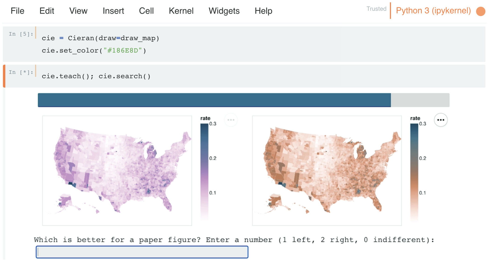

# Introduction

__Note__: This package is currently under development. The documentation is incomplete and the package is not yet available on PyPI. However, the code is available on GitHub and can be installed via pip.

## What is Cieran?

Cieran is a Python package for designing visualization colormaps via active preference learning.

Using pairwise comparisons, Cieran learns your preferences toward visualization colormaps. It uses this model to both **rank** expert-designed colormaps and **create** new ones.



## Installation

Use the package manager [pip](https://pip.pypa.io/en/stable/) to install cieran.

```bash
pip install cieran
```

## Usage

```python
from cieran import Cieran
cie = Cieran(draw=draw_map)
cie.set_color("#f88253")

cieran.teach() 
cieran.search()
```

## Citing Cieran

If you use Cieran in your research, please cite the following paper:

```
@inproceedings{hong2024cieran,
  title={Cieran: Designing Sequential Colormaps via In-Situ Active Preference Learning},
  author={Hong, Matt-Heun and Sunberg, Zachary N. and Szafir, Danielle Albers},
  booktitle={Proceedings of the CHI Conference on Human Factors in Computing Systems (CHI '24)},
  year={2024},
  publisher={ACM},
  address={New York, NY, USA},
  doi={10.1145/3613904.3642903}
}
```

## License
[GNU GPLv3](https://choosealicense.com/licenses/gpl-3.0/)

## Acknowledgements
Cieran borrows code from the [APReL](https://aprel.readthedocs.io/en/latest/) package licensed under the MIT License. We would like to thank the original authors for their contributions.
